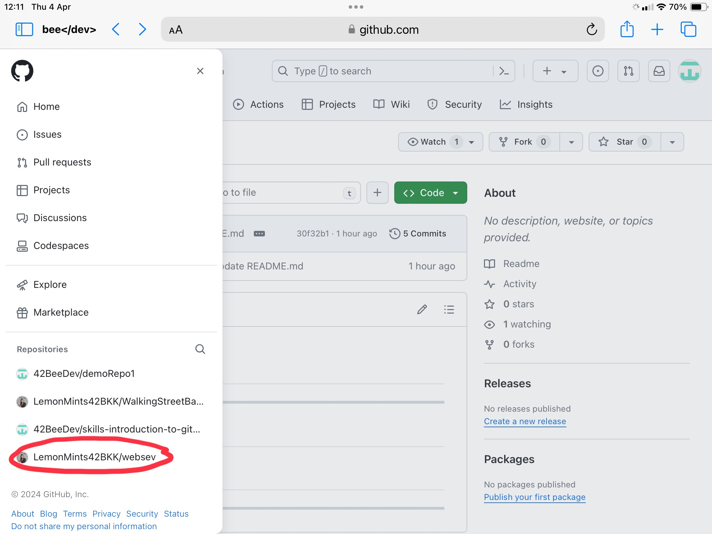
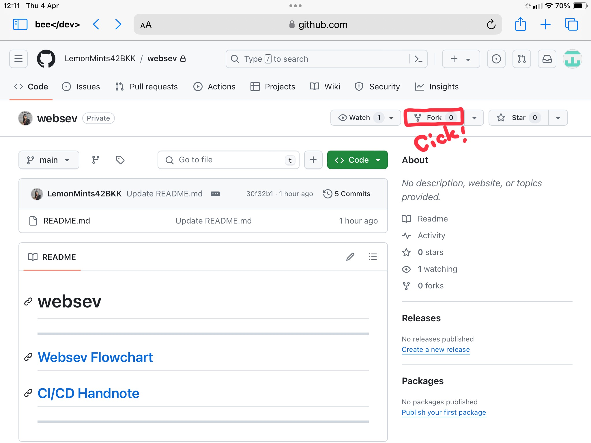
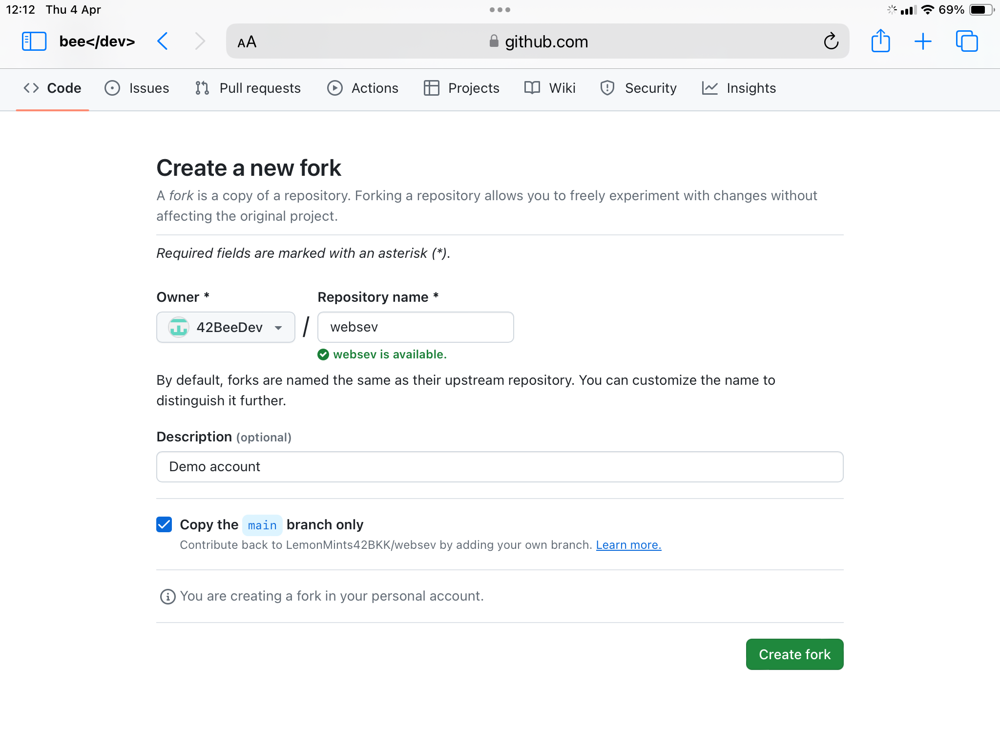
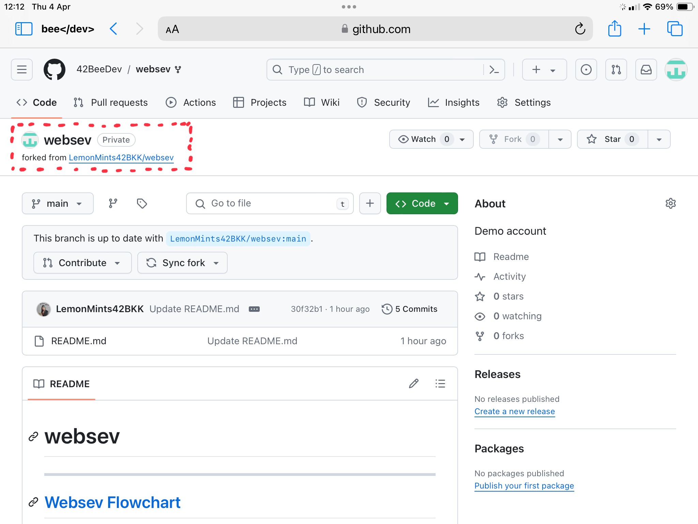
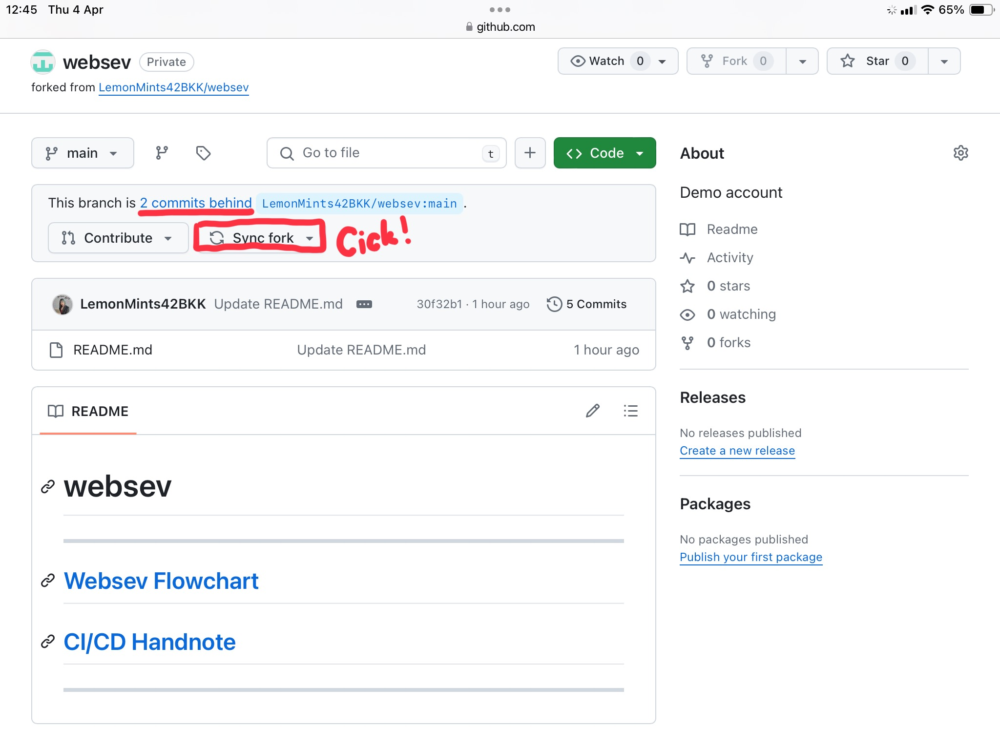
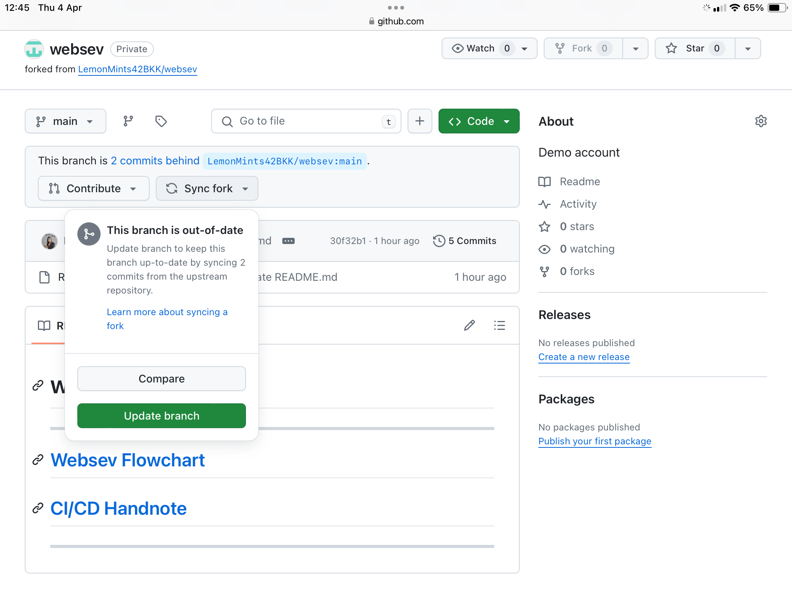
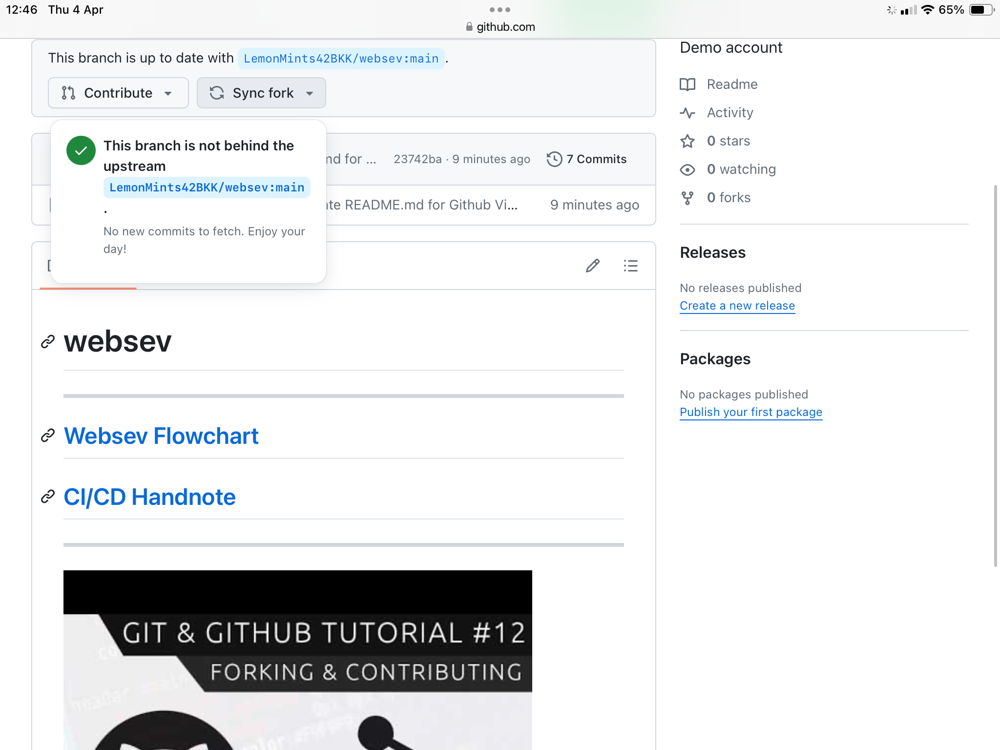
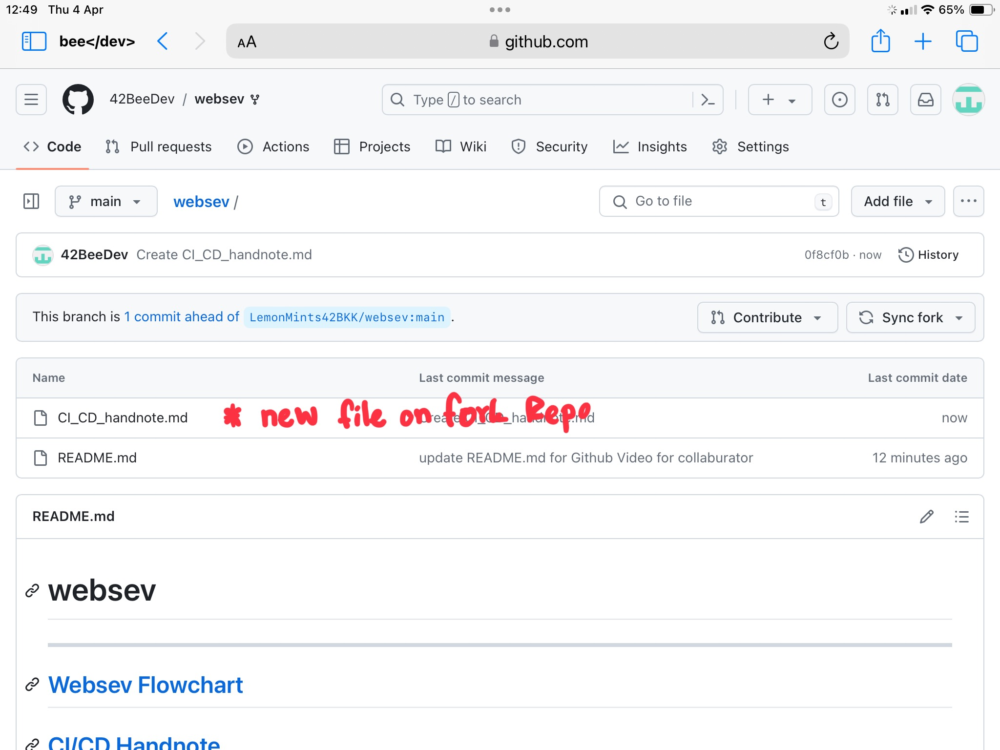
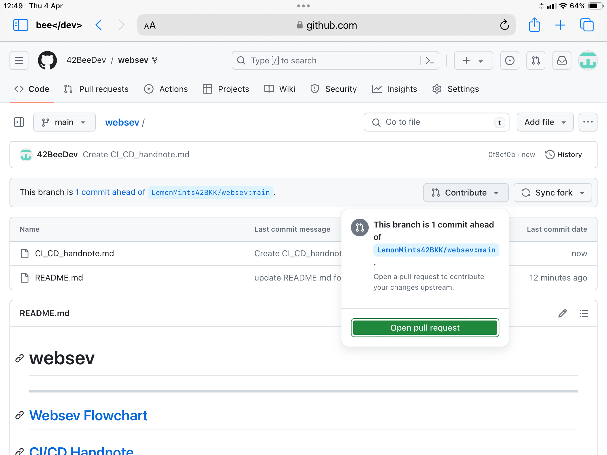

* After accept collaborate invited on email. that is Upstream Repo.


* To create Forked Repo.



* Now you in Forked Repo of Webserv project.


* If you need to get the change from the upstream, original repo, you can go to directory where you forked repo is and type.
  ```
  $ git fetch upstream
  $ git checkout -b new-branch
  $ git merge upstream/main
  ```
  There three commands fetch the changes from the upstream repo, ensure that you're on your local, forkes repo on a new branch, and then merges the changes from the upstream repo into your forked repo.
  and you can done all of this on Remote.
  
  
  
  

  * When you work on Forked repo and need to contributing changes to upstream, could done on Remote
 
  
  
    
